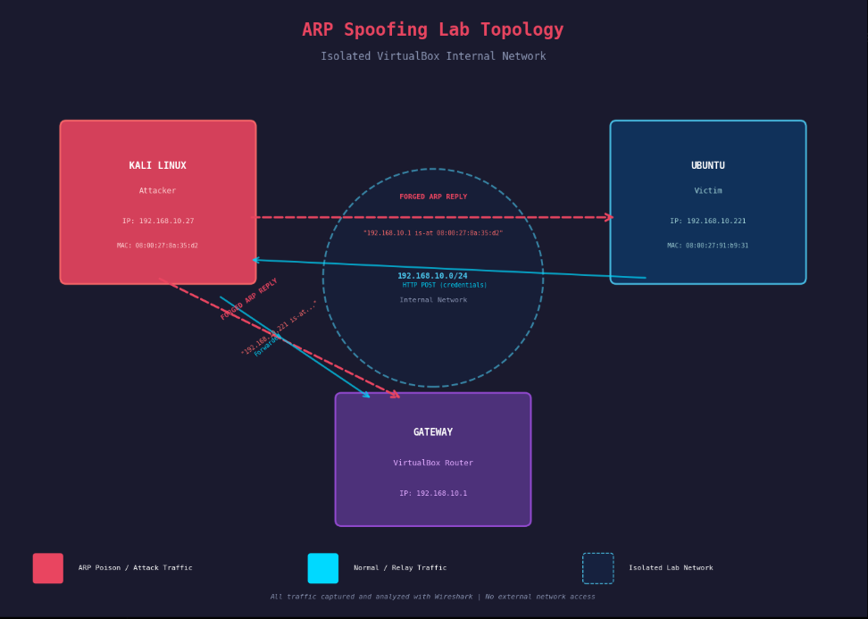

#  Test Environments

This document describes the lab environment used for the ARP Spoofing / Man-in-the-Middle (MITM) project.

---

## Lab Diagram



---

## Environment Overview

| Role        | Machine         | OS / Platform        |
|-------------|-----------------|----------------------|
| Attacker    | Kali Linux VM   | Kali Linux (Rolling) |
| Victim      | Windows VM      | Windows 10 / 11      |
| Gateway     | Router/Gateway  | VirtualBox NAT/Host-Only Network |

All machines are hosted on **VirtualBox** and connected via a shared **Host-Only Adapter** network to simulate a local area network (LAN).

---

## Machine Details

### 🔴 Attacker — Kali Linux

- **Platform:** VirtualBox VM
- **OS:** Kali Linux (Rolling Release)
- **Network Adapter:** Host-Only Adapter
- **Role:** Performs ARP spoofing and intercepts traffic between the victim and the gateway
- **Key Tools:**
  - `arpspoof` / `ettercap`
  - `Wireshark`
  - `dsniff`
  - `iptables` (for IP forwarding)

### 🔵 Victim — Windows

- **Platform:** VirtualBox VM
- **OS:** Windows 10 / 11
- **Network Adapter:** Host-Only Adapter
- **Role:** Target machine whose traffic is intercepted by the attacker
- **Purpose:** Simulates a legitimate user communicating with the gateway/internet

### 🟢 Gateway / Router

- **Platform:** VirtualBox NAT/Host-Only Network
- **Role:** Acts as the default gateway for the victim
- **Purpose:** The attacker poisons ARP caches to impersonate this device and intercept traffic

---

## Network Configuration

```
[Victim (Windows)] ──── LAN ──── [Gateway/Router]
         ↑                               ↑
         └──────── [Attacker (Kali)] ────┘
                   (ARP Poisoning / MITM)
```

| Setting             | Value                     |
|---------------------|---------------------------|
| Network Type        | VirtualBox Host-Only Adapter |
| Subnet              | 192.168.56.0/24 (default) |
| Attacker IP         | 192.168.56.x              |
| Victim IP           | 192.168.56.x              |
| Gateway IP          | 192.168.56.1              |

> ⚠️ **Note:** Update the IP addresses above to match your actual VirtualBox Host-Only network configuration.

---

## Setup Requirements

- [x] VirtualBox installed on host machine
- [x] Kali Linux VM configured with Host-Only Adapter
- [x] Windows VM configured with Host-Only Adapter
- [x] IP forwarding enabled on Kali (`echo 1 > /proc/sys/net/ipv4/ip_forward`)
- [x] Both VMs can ping each other and the gateway

---

## ⚠️ Disclaimer

This environment is for **educational and authorized testing purposes only**. ARP spoofing against networks or systems without explicit permission is illegal. All testing is performed in an isolated, self-contained virtual lab.
