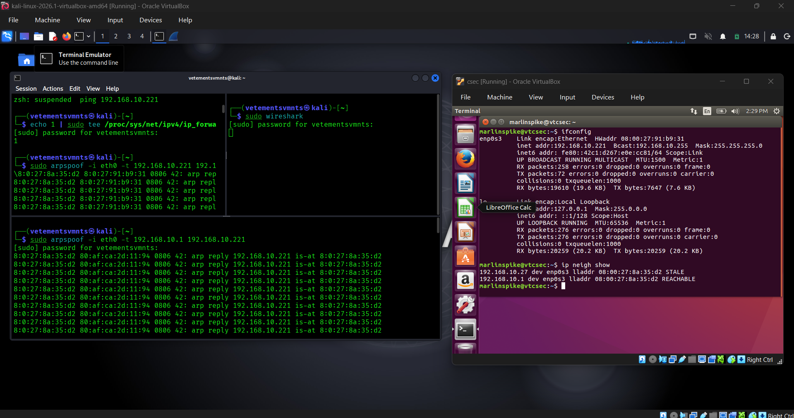
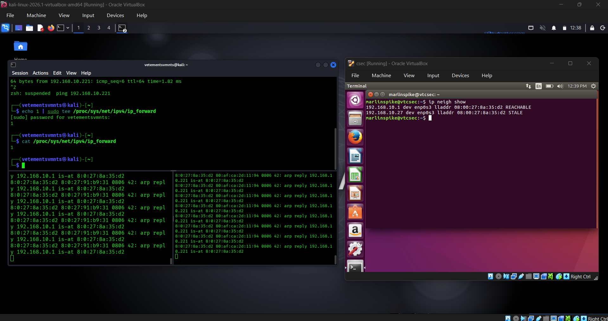
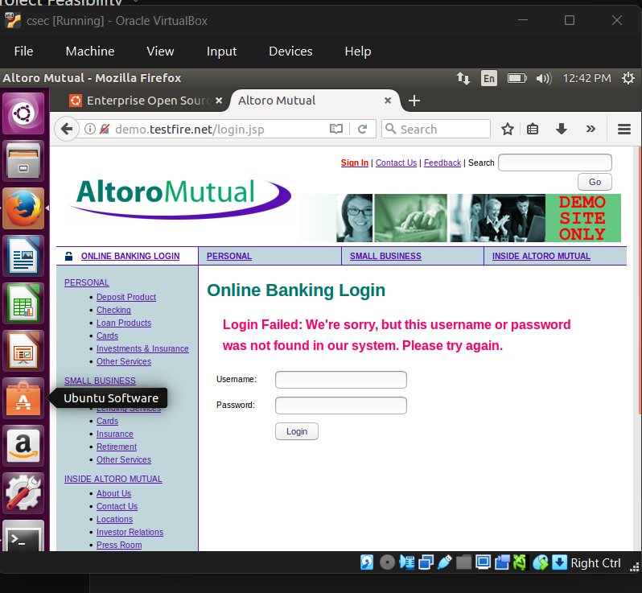
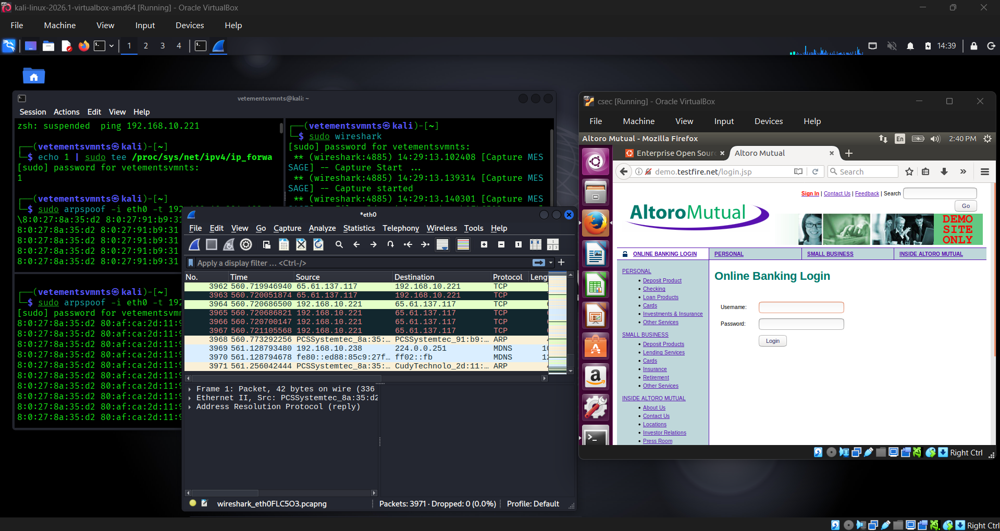
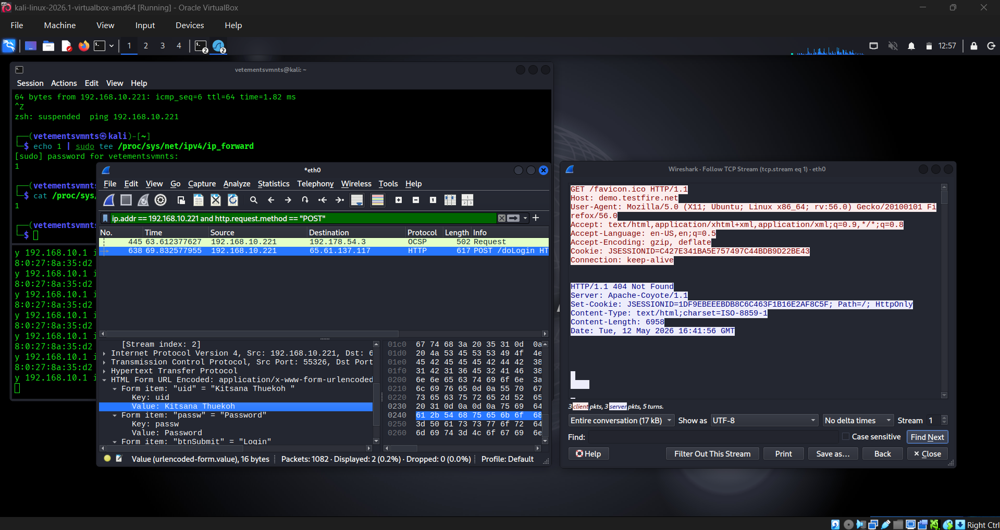

# 📁 Assets — ARP Spoofing / MITM Project

This document provides an overview of all visual assets captured during the ARP Spoofing and Man-in-the-Middle (MITM) attack simulation. Each image corresponds to a key phase of the attack lifecycle.

---

## 📋 Asset Index

| Asset | Description |
|---|---|
| [Arp.png](#1-arp-table--initial-reconnaissance) | ARP table inspection on victim/attacker |
| [Arp-Poisoning.png](#2-arp-poisoning) | Active ARP poisoning in progress |
| [Browser-packet-interception.png](#3-browser-packet-interception) | HTTP traffic intercepted from victim's browser |
| [Credential-Analysis.png](#4-credential-analysis) | Captured credentials extracted from intercepted traffic |
| [Wireshark-analysis.png](#5-wireshark-analysis) | Wireshark packet capture and analysis |

---

## 1. ARP Table — Initial Reconnaissance

> Inspecting the ARP cache to identify IP-to-MAC mappings on the local network before launching the attack.

**Key details:**
- Command used: `arp -a` (Windows) or `arp -n` (Linux)
- Identifies the gateway IP and MAC address
- Identifies the victim's IP and MAC address
- Baseline captured before poisoning begins

---

## 2. ARP Poisoning

> The attacker sends crafted ARP reply packets to both the victim and the gateway, associating the attacker's MAC address with their IP addresses.

**Key details:**
- Tool: `arpspoof` / `ettercap`
- Attacker impersonates the gateway to the victim
- Attacker impersonates the victim to the gateway
- IP forwarding enabled on Kali to maintain victim connectivity
- Result: All traffic flows through the attacker (MITM position established)

---

## 3. Browser Packet Interception

> With the MITM position established, the attacker intercepts live HTTP packets from the victim's browser activity.

**Key details:**
- Tool: `Wireshark` / `ettercap` / `dsniff`
- HTTP (unencrypted) traffic is captured in plaintext
- Demonstrates the risk of unencrypted web browsing on a shared network
- HTTPS traffic will appear encrypted (illustrates importance of TLS)

---

## 4. Credential Analysis

> Extracted and analysed credentials from intercepted HTTP traffic, demonstrating how plaintext login data can be stolen via a MITM attack.

**Key details:**
- Tool: `dsniff` / `ettercap` / manual Wireshark filter
- Plaintext usernames and passwords visible in HTTP POST requests
- Filter used in Wireshark: `http.request.method == "POST"`
- Highlights the danger of non-HTTPS login forms

---

## 5. Wireshark Analysis

> Full packet capture and deep-dive analysis of the intercepted network traffic using Wireshark.

**Key details:**
- Tool: `Wireshark`
- Capture filter: `host <victim-ip>`
- Display filter: `http` or `tcp`
- Packets inspected for credentials, session tokens, and plaintext data
- ARP poisoning visible in the ARP traffic (duplicate IP entries, gratuitous ARPs)

---

## ⚠️ Disclaimer

All assets were captured in an **isolated VirtualBox lab environment** for educational purposes only. No real networks or unauthorized systems were targeted. Performing ARP spoofing or MITM attacks on networks without explicit authorization is illegal.
